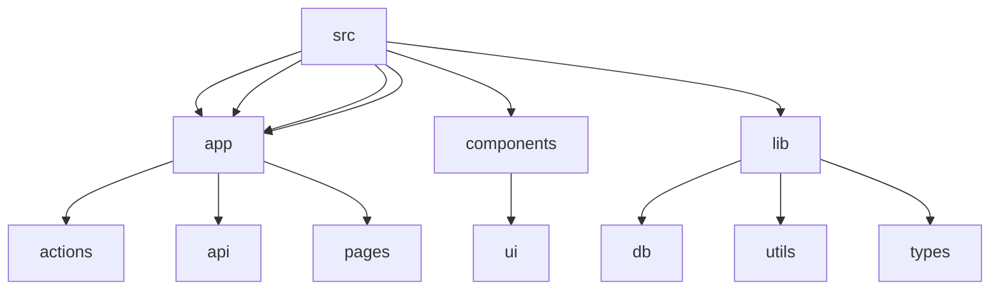

# Pegasus: A Comprehensive Educational Platform

## 🗂️  Description

Pegasus is a robust educational platform designed to streamline various aspects of academic management. This project provides a feature-rich application for administrators, students, and faculty members to interact with the system. The platform facilitates tasks such as student management, exam administration, result tracking, and more.

The primary users of this platform are administrators, students, and faculty members within an educational institution. Administrators can manage student data, create and manage exams, and track results. Students can access their dashboard, take exams, and view their results.

## ✨ Key Features

### **User Management**
* User authentication and authorization
* Role-based access control (admin, student, faculty)

### **Exam Management**
* Create, edit, and delete exams
* Assign exams to students
* Track exam results

### **Student Management**
* View student information
* Manage student enrollment
* Track student progress

### **Result Management**
* View and manage exam results
* Generate reports

## 🗂️ Folder Structure

## 🛠️ Tech Stack

## ⚙️ Setup Instructions

*   Clone the repository: `git clone https://github.com/abhraneeldhar7/Pegasus.git`
*   Install dependencies: `npm install` or `yarn install`
*   Create a `.env` file and add your database credentials
*   Run the application: `npm run dev` or `yarn dev`

## 📁 Configuration Files

The project uses several configuration files:

*   `next.config.ts`: Next.js configuration file
*   `postcss.config.mjs`: PostCSS configuration file
*   `.eslintrc.json`: ESLint configuration file
*   `tsconfig.json`: TypeScript configuration file

## 🤝 GitHub Actions

The project uses GitHub Actions for continuous integration and deployment. The workflow is defined in the `.github/workflows` directory.

## 📝 API Documentation

The API documentation is not available yet. However, you can explore the API routes in the `app/api` directory.

## 💻 Code Structure

The codebase is organized into the following directories:

*   `app`: Application code
*   `components`: Reusable UI components
*   `lib`: Utility functions and database interactions
*   `public`: Static assets

## 🔒 Security

The project uses various security measures, including:

*   Authentication and authorization
*   Input validation and sanitization
*   Secure password storage

## 📊 Database Schema

The database schema is defined in the `schema.txt` file.

## 📝 Logs

The project uses logging to track important events. You can configure logging in the `lib/utils.ts` file.

## 🚀 Deployment

The project can be deployed to a production environment using a variety of methods, including Vercel, Netlify, or a custom server. Make sure to update the `next.config.ts` file accordingly.

  

<h3>Abhraneel Dhar</h3>

Full-stack developer with experience in web, Android, and server development. Most of their code is private due to production constraints.

 

  <a href="https://gitfull.vercel.app">Made by GitFull</a>

    